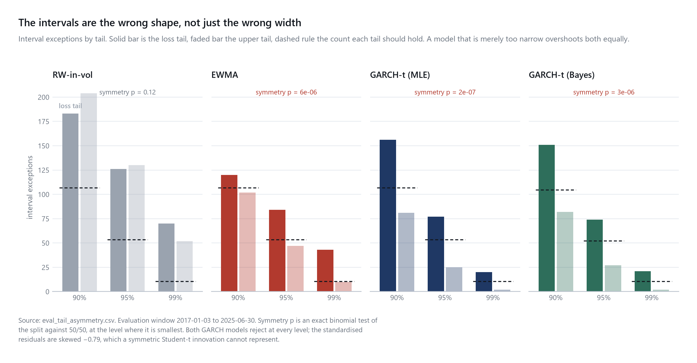

# Trusting the Error Bars: Calibration of Frequentist vs Bayesian Volatility Forecasts

**A GARCH model can pass the standard calibration test while every interval
breach lands in the loss tail.** Over a 2,134-day out-of-sample window on SPY,
both a frequentist and a Bayesian GARCH(1,1)-t put their exceptions
overwhelmingly below the interval at every level: 156/81 at 90%, 77/25 at 95%,
20/2 at 99%, against equal tails expected. That rejects symmetry at p between
1.2 × 10⁻⁴ and 2.5 × 10⁻⁷. The cause is a standardised-residual skew of −0.79
that a symmetric Student-t innovation has no parameter to represent. Meanwhile
the PIT mean is 0.4998 and the KS test passes at p = 0.115: the misallocation
cancels in aggregate, so the usual distributional check cannot see it.



**Integrating over parameter uncertainty changes no coverage number.** The
posterior predictive is 0.32% wider at 99% than the plug-in at its own posterior
mean (exactly what theory predicts), and the two have identical coverage at
every level, in every regime, and identical breach counts. Nothing in 2,092 days
of returns lands in that gap, and re-running the whole Bayesian backtest under
each rejected prior leaves that figure identical to four decimal places.
Changing the innovation distribution, by contrast, moves 99% coverage from
0.9775 to 0.9897. **The error bars are set by the distributional assumption,
not by the treatment of parameters.**

**Status: complete.** 351 tests pass, one skipped by design; the pipeline
reproduces byte for byte from a fresh clone, the NUTS-sampled track included.
Write-up: [`report/report.md`](report/report.md).

## Research question

For one-day-ahead S&P 500 volatility, are the predictive intervals of a frequentist
GARCH(1,1)-t model and its Bayesian counterpart calibrated at their nominal levels out
of sample, and does that calibration survive high-volatility regimes?

The method compares a **frequentist plug-in predictive distribution** against a
**Bayesian posterior-predictive distribution** built from the *same* GARCH likelihood.
The two share a likelihood and differ in the estimator: the Bayesian predictive
integrates over parameter uncertainty, and its priors also move the point estimate off
the MLE. The question is whether integrating over parameter uncertainty improves
predictive-interval calibration, and the `garch_bayes_mean` track isolates it from the
priors' effect.

## Findings

These are the counts behind the opening. Under a symmetric predictive the two tails
should be equally populated whatever the model gets wrong about scale, and for both
GARCH models they are not, at every level:

| level | GARCH-t below / above | expected each tail | symmetry test |
|---|---|---|---|
| 90% | 156 / 81 | 106.7 | p = 1.3 × 10⁻⁶ |
| 95% | 77 / 25 | 53.4 | p = 2.5 × 10⁻⁷ |
| 99% | 20 / 2 | 10.7 | p = 1.2 × 10⁻⁴ |

The standardised residuals carry a skew of **−0.79 (p ≈ 10⁻⁴⁰)**: the GARCH filter removes
the volatility clustering and leaves the asymmetry untouched, because a constant-mean model
with symmetric Student-t innovations has no parameter that could represent it.

The naive baseline is *not* asymmetric at any level; it is simply too narrow. Wrong shape
and wrong scale are different failures, and only one of them shows up in a coverage number.

**Regime dependence.** No evidence that tail calibration degrades in high volatility. Both
GARCH models breach their 99% VaR at a rate indistinguishable from nominal when VIX is
below 15 (1.19%) *and* above 25 (1.15%, 1.47%), and clearly too often in the middle band
(2.3%). The baselines degrade monotonically with volatility, which is what one would have
predicted for all four.

Stated carefully, because the obvious phrasing overstates it: the middle band is
significantly worse than **calm** (+1.14pp, CI [+0.16, +2.13]) and worse than nominal, but
it is **not** distinguishable from the stressed regime (+1.18pp, CI [−0.17, +2.34]); 347
stressed days holding four breaches cannot settle that. Under the alternative regime
definition no pairwise difference is significant at all. This is a failure to find an
effect, not a demonstration that there is none.

**Model-class separation.** The models separate by model class, not by estimator. Both
GARCH models beat both baselines on QLIKE with bootstrap intervals nowhere near zero. The
frequentist and Bayesian pair differ by half a percent of the loss level, and the plug-in
at the posterior mean cannot be separated from the MLE plug-in at all.

## What the protocol expected, and what happened

The design was fixed before any code existed and is left as written in
[`docs/project1-implementation-plan.md`](docs/project1-implementation-plan.md), including
where it turned out to be wrong. That is the point of pre-registering it.

| The protocol said | What the data said | |
|---|---|---|
| "Identical likelihood, plug-in vs posterior predictive — any interval difference is parameter uncertainty, **full stop**." | Two causes, not one. The priors move the point estimate off the MLE and dominate: at 99%, parameter uncertainty **+0.32%**, priors **−1.9%**, in opposite directions. | **wrong** |
| "Bayesian intervals should be ≥ frequentist at every level — if not, hunt for a bug." | Narrower at 90/95, wider at 99. Not a bug: a scale mixture is leptokurtic against the single distribution at its average variance. | **wrong** |
| "Models are hard to separate — that's the setup for the calibration act." | GARCH beats the baselines decisively; the two GARCH models cannot be separated from each other. | **half** |
| "Christoffersen is the money test: it detects clustered failures." | Fires for no model. The failure is in the *level* of tail risk, not its timing. | **reversed** |
| Risk register: "Bayesian ≈ frequentist everywhere — still a finding: parameter uncertainty moves intervals less than innovation choice." | Exactly this. Identical coverage, identical breach counts, invariant to the prior. | **correct** |
| GARCH-normal "expected to fail hard" at 99%. | Fails hard: PIT p = 2.6 × 10⁻⁴ against the t's 0.115; 53 breaches against 37. | **correct** |
| "Few stressed-regime observations" — certain risk. | 347 days, four breaches, intervals wide enough to admit a third of nominal or double it. | **correct** |
| *(not anticipated — no model in the lineup can express skew)* | The intervals are asymmetric at every level, p between 10⁻⁴ and 10⁻⁷, driven by −0.79 residual skew. The opening of this file. | **unforeseen** |

**Four claims this project published turned out to be false**, and are recorded as false
rather than quietly amended: three from the protocol above, plus one of its own later
findings: an earlier wording of the regime result, stated more strongly than the test
underneath it supported. The version in Findings is the corrected one. See
[`research_log.md`](research_log.md) §1.13 and §1.19, and
[`docs/problems-and-solutions.md`](docs/problems-and-solutions.md) #38, #41, #42 and #46.
In every case the code was correct and the *sentence about* the code was wrong.

A pre-registered design that produced surprises is worth more than one that confirmed
itself. The full argument, with every caveat that qualifies it, is in
[`report/report.md`](report/report.md).

## Models compared

Every stage of the governing plan is delivered. There are four forecasters (both
baselines, the frequentist GARCH(1,1)-t and the Bayesian GARCH(1,1)-t) plus two
ablations, each with a forecast table over the 2,134-day evaluation window. The Bayesian
model is fitted by NUTS at each of the 102 refit dates, 100 of which converged. The
evaluation layer scores all of it: point losses, PIT, interval coverage, Kupiec and
Christoffersen, Diebold-Mariano, the regime split, and block-bootstrap intervals
throughout. Robustness covers the proxy scale, the refit cadence, the regime definition,
the innovation distribution, and a full re-run of the Bayesian backtest under each prior
the design rejected. Stage numbers follow
[`docs/project1-implementation-plan.md`](docs/project1-implementation-plan.md), the
governing plan.

| # | Model | Key | Role | State |
|---|---|---|---|---|
| 1 | Yesterday's volatility | `yesterday` | Naive baseline | built |
| 2 | EWMA / RiskMetrics | `ewma` | Industry baseline | built |
| 3 | GARCH(1,1)-t, frequentist MLE | `garch_mle` | Plug-in predictive | built |
| 4 | GARCH(1,1)-t, Bayesian | `garch_bayes` | Posterior predictive | built |

Models 3 and 4 share one log-likelihood implementation (`src/models.py`), so that "the
same underlying likelihood" is a property of the code rather than a claim. Since Stage 3
it is a property that is checked: PyMC builds its own graph rather than calling that
implementation, and a test requires the two to agree at a fixed parameter vector.

**What that does and does not license.** The two models differ in the *estimator*, not in
the model. It does **not** follow that the difference between their intervals is
parameter uncertainty, and an earlier version of this README said it did. The frequentist
predictive sits at the maximum of the likelihood; the Bayesian one integrates a posterior
that the priors have moved off that maximum. Measured over the full evaluation window at the
99% level, parameter uncertainty widens the interval by 0.3% and the priors narrow it by
1.9%. They point opposite ways, and the priors are roughly six times the larger. And the
regime dependence is entirely the priors: parameter uncertainty's contribution is flat
across calm, normal and stressed days to within four parts in ten thousand. The mechanism
and the numbers are in `research_log.md` §1.13-1.14; the trap is
problems-and-solutions #41. The `garch_bayes_mean` track below exists to keep the two
apart.

Two further tracks are carried through the same backtest, and neither is a competitor.
`backtest.HEADLINE_MODELS` excludes both and the evaluation layer filters on that tuple.

`garch_mle_normal` is the **innovation ablation**: normal versus Student-t, the cheap and
decisive lever on 99% tail coverage. It is carried through the main backtest because doing
so costs five seconds per run and saved re-entering the walk-forward loop at Stage 6.

`garch_bayes_mean` is the **plug-in predictive at the posterior mean**, and it exists
because of the confound described above. It holds the point estimate fixed at what the
Bayesian model uses, so the only thing separating it from `garch_bayes` is whether the
posterior is integrated over:

| comparison | isolates |
|---|---|
| `garch_bayes` vs `garch_bayes_mean` | parameter uncertainty, and nothing else |
| `garch_bayes_mean` vs `garch_mle` | the priors' effect on the point estimate |

It costs no sampling (it reuses the posterior each refit already produced), and it is
built inside the same loop rather than from the persisted posterior means, so the two
tracks cannot fall out of step.

## Locked design decisions

| Item | Value |
|---|---|
| Asset | SPY |
| Frequency | Daily |
| Data source | Yahoo Finance via `yfinance` |
| Main sample | 2014-01-01 to 2025-06-30 |
| Initial training period | 2014-01-02 to 2016-12-30 |
| Out-of-sample period | 2017-01-03 to 2025-06-30 |
| Returns | Daily log returns from adjusted close |
| Point-forecast proxy | Parkinson variance from daily high/low |
| Calibration target | Observed daily returns |
| Forecast horizon | 1 trading day |
| Refit cadence | Every 21 trading days |
| Intervals evaluated | Two-sided 90%, 95%, 99%; one-sided 99% VaR |
| Primary point loss | QLIKE |
| Secondary point loss | MSE on the variance scale |
| Primary comparison test | Diebold-Mariano, with caveats |
| Uncertainty quantification | Stationary block bootstrap, mean block length 20, 1,000 replications, fixed seed |
| Regimes | Lagged VIX close: calm < 15, normal 15-25, stressed > 25 |

Explicitly **out of scope** in the core version: LSTM, Transformer, stochastic
volatility, macro variables, multiple assets, dashboards.

The plan of work is [`docs/project1-implementation-plan.md`](docs/project1-implementation-plan.md):
eight stages, a ~15-20h budget, and an ordered cut list. The full decision register (39
numbered decisions, several of them refusals) is in
[`research_log.md`](research_log.md); §1.5 there records the 2026-08-23 switch to this
plan and the retirement of the earlier one, which was deleted at the switch and
survives only in git history (see `git log -- docs/implementation_plan.md`).

[`docs/problems-and-solutions.md`](docs/problems-and-solutions.md) gives a
problem-oriented view of the same history: every difficulty encountered, why it mattered,
and the fix now in the repository. Forty-six entries covering the look-ahead hazards, the
proxy scale mismatch, the environment and toolchain work, and a set of test-integrity
lessons that generalise beyond this project, including the four occasions this project's
own published claims turned out to be wrong.

## Quantities that must not be conflated

This project involves several distinct objects that are easy to blur together. They
are kept distinct in code and in the report:

- **Observed returns**: realised daily log returns. The target for interval
  calibration and VaR.
- **Parkinson volatility proxy**: a high/low range estimator of *intraday* variance.
  The target for point-forecast loss only. It is **not** the same quantity the models
  forecast (see the caveat below).
- **Conditional variance forecast**: the model's one-day-ahead variance.
- **Predictive interval**: a two-sided interval for the *return*, not for the variance.
- **VaR forecast**: a one-sided lower quantile of the return distribution.
- **Parameter uncertainty**: uncertainty about GARCH coefficients. Present in the
  Bayesian posterior predictive; absent from the frequentist plug-in. **Not** the same
  thing as the difference between the two models' intervals, which also contains the
  priors' effect on the point estimate (see above).
- **Innovation uncertainty**: uncertainty from the Student-t shock. Present in both.

### Known caveat: Parkinson is not on the forecast target's scale

Parkinson variance estimates the variance of the *intraday continuous* price path. The
GARCH models forecast the variance of the *close-to-close* return, which also contains
the overnight gap. Parkinson is therefore biased low relative to the forecast target,
and QLIKE's proxy-robustness property assumes a conditionally unbiased proxy. This
affects the **point-forecast loss only**; the interval-calibration and VaR results are
evaluated against observed returns and are unaffected. A test asserts that, by scrambling
the proxy and requiring every calibration number to come back bit-identical. The robustness
check re-scores every model against the **raw, unscaled Parkinson series**: the ranking is
unchanged, so it is a fact about the models rather than about `c`. The caveat belongs in the
results section of the report, not only the methods section.

## Installation

```bash
python -m venv .venv
.venv\Scripts\activate        # Windows
pip install -r requirements.txt
```

Requires Python 3.12 **and a C/C++ compiler on `PATH`**: PyMC's PyTensor backend needs
one. `pip install -r requirements.txt` does not supply it, so it is the one part of the
environment that is not reproducible from that file alone.

This machine uses **MinGW-w64 GCC 16.2.0** (UCRT, x86_64) from the
[WinLibs](https://winlibs.com/) release `16.2.0posix-14.0.0-ucrt-r1`, unpacked to
`C:\toolchains\mingw64` and added to the user `PATH`. It is portable: no
administrator rights are needed, and uninstalling means deleting that directory. Verify
with:

```bash
g++ --version                 # expect 16.2.0
python -c "import pytensor; print(pytensor.config.cxx)"
```

MSVC Build Tools works equally well if you already have it. Provenance, the verified
SHA-256, and why this replaced the earlier compiler-free design are in `research_log.md`
§1.6 (decision B1-R).

## Usage

```bash
python run_all.py --help            # list pipeline stages
python run_all.py --stage data      # build the analysis frame
python run_all.py --stage eda       # ARCH-LM, Ljung-Box, ADF + Stage 0 figures
python run_all.py --stage backtest  # walk-forward loop, baselines + MLE GARCH (~1 min)
python run_all.py --stage bayes     # the Bayesian track, 102 NUTS fits (~95 min)
python run_all.py --stage evaluate   # losses, coverage, VaR backtests, DM, bootstrap CIs
python run_all.py --stage robustness # raw proxy, 63-day cadence, prior sensitivity (~30s)
python run_all.py --stage figures    # the report figures, from the evaluation tables
python run_all.py --stage priors     # prior sensitivity backtests, ~190 min, opt-in
python run_all.py --all              # the pipeline (everything except `priors`)
```

**The backtest is two stages, for cost rather than design.** `--stage backtest` refits
GARCH at each of the 102 refit dates for both innovation distributions: 306
maximum-likelihood fits, about a minute. `--stage bayes` runs the same walk-forward loop
over the same refit dates with NUTS, which takes about ninety-five. Each writes its own
partial tables and rebuilds the merged `forecasts.csv` from whichever partials are on
disk, so re-running the cheap track never re-runs the expensive one and the evaluation
layer still reads one table. The merge compares the two configurations and refuses to
join runs made under different ones.

A Bayesian refit that fails its convergence diagnostics produces no forecasts for the 21
days it serves, and those days stay NaN rather than being filled from the previous
window. Two of the 102 did, so `garch_bayes` has 2,092 of the 2,134 rows.

`--stage data` uses the committed snapshot in `data/raw/` and makes no network call;
pass `--refresh` to re-download, which deliberately replaces that snapshot. It prints the
full data quality report and writes `data/processed/analysis_frame.csv`.

`--stage evaluate` reads `forecasts.csv` and refits nothing, writing sixteen `eval_*.csv`
tables to `data/processed/`; `--stage robustness` adds the Stage 6 checks and re-runs only
the cheap frequentist track; `--stage figures` draws solely from those tables, so a figure
and the number it plots cannot disagree. All three run in seconds.

`--stage priors` is the one stage `--all` leaves out. It re-runs the Bayesian backtest
under each of the two `delta` priors the design considered and rejected (about 190
minutes for a robustness check that produces no headline number), and writes to
`data/processed/prior_sensitivity/`. It cannot touch `forecasts.csv`: the merge that
rebuilds that file iterates over a fixed set of tracks, which these runs are not in.

## The scale convention

Every variance forecast in this project and the evaluation proxy are on the
**close-to-close return-variance scale**. This is what makes the four models comparable
to each other and their intervals comparable to observed returns.

The Parkinson estimator is built from the intraday high/low range and so sees no part of
the overnight move, which for SPY is a large share of daily variance. It understates
close-to-close variance by roughly a third. The correction is a single constant estimated
on the warm-up sample only and frozen:

```
c = mean(r^2) / mean(sigma^2_P) = 1.517318      (2014-01-02 .. 2016-12-30, n = 756)
```

Without it the error would pull in two directions at once: the `yesterday` baseline would be
unfairly advantaged on QLIKE (its units match the raw proxy) while its intervals came out
~23% too narrow, so it would win the point-forecast table and fail the calibration table
for reasons having nothing to do with forecasting. Separately, QLIKE's proxy-robustness
(Patton 2011) presumes an unbiased proxy.

**What `c` does not do.** It removes the systematic level error but does *not* make the
proxy conditionally unbiased: within the warm-up alone the quarterly ratio ranges from
1.18 to 1.94, and the overnight share plausibly co-moves with regime. The proxy is
approximately unbiased *on average*; proxy-robustness is approached, not restored. The
QLIKE ranking was re-run on raw Parkinson and is unchanged, so it does not hinge on `c`
(`eval_raw_proxy_losses.csv`).

## The look-ahead audit

The single test the whole project's credibility rests on. It runs the backtest, corrupts
every observation from a date `t` onward, re-runs, and asserts the forecasts are
bit-identical before `t`. The corruption dates are Volmageddon, the largest COVID
drawdown day, and a 2022 selloff.

A precise distinction is built into it. Corrupting from `t` must leave the *forecast*
columns unchanged up to and including `t`, because the forecast for `t` is built from
data through `t-1`. It must **not** leave the *evaluation* columns at `t` unchanged:
`log_return` and its `pit` are functions of day `t` itself. Asserting the stronger claim
would be asserting something false, and would have to be weakened later, which is how a
look-ahead test quietly stops testing anything.

`test_corruption_actually_changes_the_future` sits beside it, because everything above
would also hold for a backtest that ignored its input entirely.

Since Stage 2 the audit covers the GARCH models, which is the first time it has had
anything to say. Both baselines are parameter-free, so until there was a model that
estimated something the audit could not have caught a refit trained on data it should
not have seen. Every route by which the future could reach a forecast is now inside its
scope: the estimation window, the backcast seed, and the daily filter.

Since Stage 3 the Bayesian track is audited too, under the same corruption dates and the
same claim, but against a **recording stub** in place of NUTS. That is not a concession.
A Bayesian refit costs 9-17 seconds before it draws anything, because the floor is
compiling the gradient of the variance recursion, so a real-sampler audit would put a
default `pytest` near two hours. An audit that slow gets skipped, which is the cut the
never-cut list exists to prevent. Every look-ahead surface still runs in the real code
path at all 102 refit dates, and the stub also records the exact array each fit
was handed, so "no fit saw data from on or after its own refit date" becomes an assertion
on the sampler's input rather than an inference from its output. The real sampler is
audited end to end behind an opt-in flag.

```bash
pytest -q                              # everything, including both audits (~18 min)
pytest -m "not slow" -q                # inner loop (~2 min)
pytest --bayes-audit -m bayes_audit    # the audit with NUTS itself (~40 min)
```

The `slow` marker covers the 26 tests that need a backtest run: the six corrupted
re-runs of the two audits, the two vacuity checks beside them, the determinism test, and
the model-recovery tests that fit or sample from scratch. Everything else shares one
module-scoped run, which is why the inner loop still costs a minute rather than seconds.
Plain `pytest` runs the marked tests too. The audit is on the governing plan's never-cut
list, and a default test run must not be the thing that skips it.

### What the EDA establishes

Diagnostics are computed on the **training window only** (2014-01-02 to 2016-12-30).
Justifying the model class with a statistic computed over the out-of-sample period would
let the evaluation window argue for the model later evaluated on it: a mild look-ahead,
but the exact species this project exists to detect. Full-sample values are printed as
labelled descriptive context and justify nothing.

| Diagnostic | Training-window result |
|---|---|
| ARCH-LM (Engle), lags 5 / 10 / 22 | p = 1.5e-23 / 1.8e-21 / 1.0e-17 — rejects at every lag |
| Ljung-Box, **squared** returns | p = 3.4e-44 / 1.1e-51 / 1.8e-47 — rejects |
| Ljung-Box, **raw** returns | p = 0.45 / 0.62 / 0.26 — no rejection |
| ADF on returns | -27.39, p < 1e-300 — stationary |
| Excess kurtosis | 2.46 |

The contrast between the two Ljung-Box rows is the point, not the first row alone:
abundant structure in the second moment, none detectable in the first. That is the regime
in which a conditional-variance model earns its place. The excess kurtosis is the
independent empirical warrant for the Student-t innovation.

A known limitation, recorded up front: over the **full** sample the raw-return Ljung-Box
does reject (p = 7.1e-14), as short-horizon autocorrelation rises in crises. The constant
mean is applied identically to all four forecasters so it cannot bias the comparison, but
it is a real simplification over the evaluation period and is carried into the report's
limitations section.

### What the GARCH fit establishes

Two cadences run in the backtest and conflating them is the subtle bug the harness was
built to prevent. Parameters are re-estimated every 21 trading days on the expanding
window; *between* refits they are held fixed while the variance recursion still advances
daily with each newly observed return. Freezing the variance between refits as well
would produce a complete, plausible forecast table built on variances up to 21 days
stale. That is not a one-day-ahead GARCH forecast at all.

On the warm-up window (756 observations, training only):

| Quantity | Value |
|---|---|
| mu, omega | 0.000704, 4.81e-6 |
| alpha, beta, alpha + beta | 0.2150, 0.7353, 0.9503 |
| nu (Student-t d.o.f.) | 5.86 |
| Ljung-Box, standardised **residuals**, lags 5 / 10 / 22 | p = 0.50 / 0.57 / 0.29 — no rejection |
| Ljung-Box, **squared** standardised residuals | p = 0.62 / 0.88 / 0.98 — no rejection |
| Refits converged | 102 / 102 for both innovation distributions |

The squared-residual row is the one that matters. The same test on raw squared returns
rejects at p = 3.4e-44; after the GARCH filter there is nothing left to reject, so the
variance equation has absorbed the clustering it was fitted to absorb. The residual row
says the constant mean is adequate in sample, which is consistent with the raw-return
Ljung-Box above and does not disturb the limitation recorded there about the evaluation
period.

An independent check on the likelihood: the Stage 3 feasibility probe fitted this same
window with PyMC under priors and obtained alpha 0.219, beta 0.713, nu 6.4. A
hand-written NumPy likelihood maximised by L-BFGS-B and a `pytensor.scan` graph sampled
by NUTS share no code, so their agreement is better evidence than either number alone.

`figures/07_garch_parameter_stability.png` tracks the estimates across all 102 refits.
Persistence rises through the sample and exceeds 0.999 in 16 of them, peaking at
0.99998: every fit admissible and converged, but very nearly at the stationarity
boundary. That is ordinary for a long daily equity sample containing 2020 and 2022, and
it is recorded because the Bayesian model at Stage 3 enforces the same constraint by
construction and will press against the same edge.

### What the evaluation layer establishes

Full tables in `data/processed/eval_*.csv`, presented in `notebooks/02_results.ipynb`;
figures 08-11 and 14. Four results, three of which are not what the governing plan
expected.

**Point accuracy separates GARCH from no GARCH, not one estimator from the other.** Mean
QLIKE over the 2,092-day common sample: `garch_bayes` 0.4577, `garch_mle` 0.4599, `ewma`
0.5239, `yesterday` 0.7809. Both GARCH models beat both baselines with block-bootstrap
intervals nowhere near zero. `garch_mle` against `garch_bayes` differs by 0.0022 (half a
percent of the loss level), and `garch_bayes_mean` against `garch_mle` cannot be
separated at all.

**The 99% VaR fails on the level of tail risk, not its timing.** Every model takes far too
many breaches (87, 54, 37 and 37 against 21 expected), and Kupiec rejects for all four.
**Christoffersen's independence test rejects for none of them.** The plan called
independence the money test on the argument that correct average coverage can hide
clustered breaches; here the average coverage is wrong and the clustering is absent, which
is the mirror image. A non-rejection on 37 events is a failure to reject on a small
sample, not a demonstration that breaches are well timed, and the report says so.

**Integrating over parameter uncertainty changes no coverage number.** `garch_bayes` and
`garch_bayes_mean` have identical coverage at every level, in every regime, and identical
99% breach counts, despite the posterior predictive being 0.32% wider at 99%. Nothing in
2,092 days of returns lands in that gap. At n >= 750, parameter uncertainty is not what
determines whether a risk model's intervals are calibrated; that is the project's central
measurement, and the governing plan's risk register called it.

**The intervals are the wrong shape, and this is the strongest result of the four.** Both
GARCH models put their exceptions overwhelmingly in the loss tail at every level, rejecting
symmetry at p between 1.2 × 10⁻⁴ and 2.5 × 10⁻⁷, driven by a standardised-residual skew
of -0.79 that a symmetric Student-t innovation cannot represent. See the opening of this
file, `eval_tail_asymmetry.csv` and figure 14.

Both GARCH-t models nonetheless pass a KS test of PIT uniformity (p = 0.115 and 0.175,
approximate because the parameters are estimated) while `ewma` fails at 3e-14, `yesterday`
at 1e-7 and the `garch_mle_normal` ablation at 2.6e-4. That combination is the point of
reporting both: an aggregate distributional test passing while the tail split fails
decisively.

Regime-conditional versions of all of this, with bootstrap confidence intervals, follow
below.

### What the regime split establishes

Full tables in `data/processed/eval_regime_*.csv` and `eval_regime_differences.csv`,
figures 12-13, presented in `notebooks/02_results.ipynb`. Days are labelled by the **lagged** VIX close, so the
conditioning information was available when the forecast was made; every estimate carries
a stationary-block-bootstrap interval computed within the regime.

**No evidence of degradation in high volatility, and the middle band is the weak spot.**
99% VaR breach rate, with 95% bootstrap intervals:

| model | calm | normal | stressed |
|---|---|---|---|
| `garch_mle` | 1.19% [0.53, 1.85] | **2.33% [1.65, 3.11]** | 1.15% [0.29, 2.02] |
| `garch_bayes` | 1.19% [0.53, 1.98] | **2.31% [1.51, 3.12]** | 1.47% [0.29, 2.93] |
| `ewma` | 1.59% [0.79, 2.38] | 2.91% [2.04, 3.88] | 3.46% [1.44, 6.05] |
| `yesterday` | 3.70% [2.51, 4.89] | 4.08% [2.72, 5.44] | 4.90% [2.88, 7.20] |

`n` is 757 / 1,030 / 347 for every model except `garch_bayes`, which is 756 / 995 / 341;
the two failed refits fall in the normal and stressed regimes. Each row is on its own
available days, and `eval_regime_var.csv` carries the `n` per row.

Both GARCH models are indistinguishable from nominal in calm *and* in stress, and clearly
too high in the middle band. The baselines degrade monotonically with volatility, the
pattern one would have predicted for all four.

**The differences between regimes need their own test, and only one survives it.** A regime
that rejects against nominal where another does not is not thereby different from it: the
regimes have very different sample sizes, and rejection against a fixed rate is partly a
question of power. Bootstrapping the difference directly (`eval_regime_differences.csv`):

| difference in 99% breach rate | GARCH-t (MLE) | supported? |
|---|---|---|
| normal - calm | +1.14pp [+0.16, +2.13] | **yes** |
| normal - stressed | +1.18pp [-0.17, +2.34] | no |
| calm - stressed | +0.04pp [-1.22, +1.14] | no |

So the project asks whether 99% still means 99% when VIX > 25, and the honest answer is
that this sample cannot show it failing there, not that it holds. What *is* supported is
that the middle band is worse than calm and worse than nominal.

**The tail misallocation in the opening is concentrated here.** At the 99% two-sided level in
the normal regime, `garch_mle` puts **14 breaches below the interval and none above**,
against 5.2 expected in each tail. Total coverage there is 0.9864 against a nominal 0.99
(a near miss), while every breach is a loss. The asymmetry is significant on the full sample
independently of any regime split, which is why it leads the findings above rather than
this section.

**The sensitivity agrees.** Under terciles of trailing 21-day Parkinson volatility, with
cut points estimated on the warm-up window alone so the labels carry no look-ahead either,
the GARCH models are closest to nominal in the *top* tercile (1.35%, Kupiec p = 0.29) and
worst in the bottom one (2.06%, p = 0.012). The two definitions disagree about which
non-stressed bucket is weakest, and agree in finding no evidence of degradation in high
volatility. Under this definition no pairwise regime difference is significant at all.

**What this does not establish.** *Why* the middle band is the weak spot is a conjecture:
15-25 is where regime transitions happen and a GARCH forecast lags a change in level by
construction, but this design cannot test that. And the stressed intervals are wide:
[0.29%, 2.02%] admits rates from a third of nominal to double it, which is why the
difference tests above, not the regime-by-regime table, carry the conclusion.

### What the robustness checks establish

Four alternatives to decisions the design made, plus the innovation ablation. Full tables
in `data/processed/eval_raw_proxy_losses.csv`, `eval_cadence_comparison.csv`,
`eval_prior_sensitivity.csv` and the `_trailing` regime tables; presented in
[`notebooks/03_robustness.ipynb`](notebooks/03_robustness.ipynb).

| check | verdict |
|---|---|
| QLIKE on the **raw, unscaled** Parkinson proxy | ranking unchanged — a fact about the models, not about `c` |
| Refit cadence **63 days** instead of 21 | QLIKE 0.4610 → 0.4616, breaches 37 → 35, Kupiec still rejects |
| Regime split on **trailing-vol terciles** instead of VIX | the finding survives; the two definitions disagree only on *which* non-stressed bucket is weakest |
| `delta` prior: **`Beta(10,2)`** and **`Beta(1,1)`** instead of `Beta(3,1)` | parameter uncertainty identical to four decimals; no calibration verdict moves |
| Innovations: **normal** instead of Student-t | fails PIT at 2.6e-4 against the t's 0.115; 53 breaches against 37 |

The prior sensitivity is the one that mattered most, because the project's central finding
is *about* priors: §1.13 found the frequentist-Bayesian interval difference is mostly the
priors moving the point estimate rather than parameter uncertainty, so an unexamined prior
behind that claim would have been the one gap the project could not leave silent. Re-run
under all three candidates, parameter uncertainty's contribution is **0.9975 / 0.9989 /
1.0032 at 90/95/99% in every case**, while the priors' own contribution ranges from -1.9%
to -2.9% at the 99% level. The magnitude attributed to the priors is specific to
`Beta(3, 1)`; the direction, the dominance, and every conclusion drawn from them are not.

Set beside the parameter-uncertainty result, the innovation ablation is the sharpest
contrast the project offers: **choosing the innovation distribution moves 99% tail coverage
decisively, while integrating over parameter uncertainty does not move it at all.**

### The analysis frame

2,890 trading days, 2014-01-02 to 2025-06-30: 756 training rows (2014-01-02 to
2016-12-30) and 2,134 out-of-sample rows (2017-01-03 to 2025-06-30), implying 102 refits
at the locked 21-day cadence. Regime counts on the lagged VIX close, over the **full
sample**, are calm 1,198, normal 1,317, stressed 375; restricted to the **evaluation
window** they are 757, 1,030 and 347, which are the `n` the regime tables report. Either
way the stressed regime is around 13% of the days, which is thin for the 99% level and
thinner still for the 99% VaR, and is why no regime statistic here appears without its
`n` and an interval.

Raw data is downloaded from 2013-12-01, one month before the sample start, so that the
lagged quantities are defined on the first in-sample row. The buffer feeds the lag only
and never reaches the analysis frame (decision D8 in `research_log.md`).

## Repository layout

```
.
├── README.md
├── requirements.txt
├── conftest.py            # the --bayes-audit opt-in gate
├── pytest.ini             # registers the `slow` and `bayes_audit` markers
├── run_all.py             # single entry point
├── research_log.md        # decision register + changelog
├── docs/
│   ├── project1-implementation-plan.md   # governing plan: stages, budget, cut list
│   └── problems-and-solutions.md         # every difficulty hit so far, and its fix
├── data/
│   ├── raw/               # committed price snapshots + SHA-256 manifest
│   └── processed/         # derived, gitignored, regenerable
├── src/
│   ├── data.py            # download, caching, returns, proxy, regimes
│   ├── eda.py             # ARCH-LM, Ljung-Box, ADF, ACF
│   ├── models.py          # shared likelihood, MLE, priors, NUTS, predictives
│   ├── backtest.py        # walk-forward loop, refit schedule, two tracks, merge
│   ├── figures.py         # house style, all figures
│   ├── evaluation.py      # losses, PIT, coverage, VaR tests, DM, result tables
│   └── bootstrap.py       # stationary block bootstrap
├── notebooks/             # thin presentation layer only, committed unexecuted
│   ├── 01_eda.ipynb
│   ├── 02_results.ipynb   # every headline table and figure
│   └── 03_robustness.ipynb
├── tests/                 # 352 tests; `pytest -q` runs them all in ~18 min
├── figures/               # 14 figures, all written by run_all.py
└── report/report.md       # the mini-paper
```

## Reproducibility

- Dependencies are pinned in `requirements.txt`.
- Raw price data is committed as CSV with a SHA-256 manifest, because Yahoo Finance
  revises history and a download script alone is not reproducible.
- All stochastic components take an explicit seed.
- `run_all.py` is the only supported entry point. Notebooks read cached artefacts and
  contain no reusable logic.
- **Verified from a fresh clone**, not merely claimed. Cloning this repository and running
  the whole pipeline reproduces `analysis_frame.csv`, `forecasts_frequentist.csv`,
  `forecasts_bayes.csv` and the merged `forecasts.csv` **byte for byte**: the Bayesian
  track included, in a separate process, with identical convergence diagnostics and the
  same two refits failing on the same two dates. The only artefact that differs is the
  `seconds_elapsed` column of the refit records, which is wall-clock timing.
- That byte-fidelity is what the `.gitattributes` rule exists for: without it Git rewrites
  the raw CSVs' line endings on checkout, every SHA-256 in the manifest mismatches, and the
  pipeline refuses to run.
