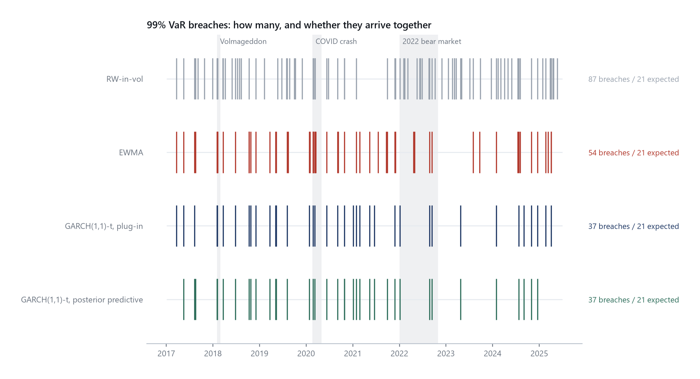
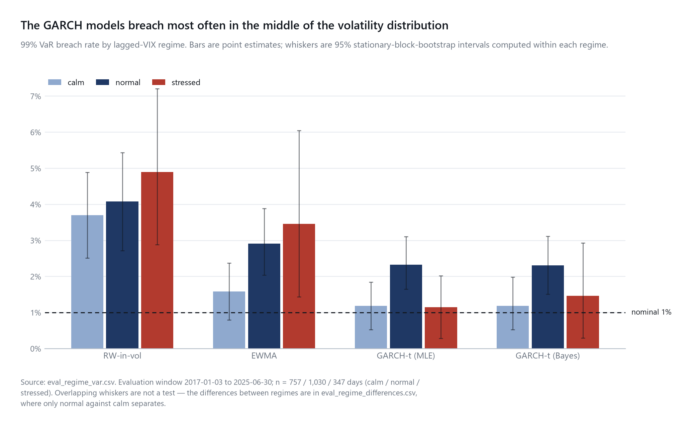

# Trusting the Error Bars: Calibration of Frequentist vs Bayesian Volatility Forecasts

*SPY daily returns, 2014-01-01 to 2025-06-30. Evaluation window 2017-01-03 to 2025-06-30
(2,134 trading days). All results reproduce with `python run_all.py --all`.*

---

## 1. Introduction

Risk management does not consume point forecasts of volatility. It consumes intervals: a
99% Value-at-Risk, a number supposed to be breached one day in a hundred. A model can
forecast the level of volatility well and still be dangerous if the uncertainty it reports
around that level is wrong. This report asks whether two standard volatility models'
intervals mean what they claim, and whether that survives a crisis.

## 2. Research question

For one-day-ahead S&P 500 volatility, are the predictive intervals of a frequentist
GARCH(1,1)-t and its Bayesian counterpart calibrated at their nominal levels out of
sample — and does that calibration survive high-volatility regimes?

The two models share **one likelihood implementation**. The frequentist version plugs in
maximum-likelihood point estimates and treats them as known; the Bayesian version
integrates over the posterior. The comparison was designed so that any difference between
their intervals would have exactly one cause: parameter uncertainty.

**It turned out to have two, and saying so is part of the result.** The frequentist
predictive sits at the maximum of the likelihood; the Bayesian one integrates a posterior
that the priors have moved off that maximum. Those are two different point estimates, and
the priors move the interval more than the integration does. The project's own design note
claimed otherwise until this was measured (`research_log.md` §1.13). A third track,
`garch_bayes_mean` — the plug-in predictive at the *posterior mean*, built from the same
fits — separates them, and every statement below about parameter uncertainty comes from
that decomposition rather than from the raw frequentist-Bayesian difference.

## 3. Data and target

SPY daily OHLCV and ^VIX closes from Yahoo Finance, cached as a committed snapshot with a
SHA-256 manifest so results cannot drift if the vendor revises history. 2,890 trading days:
756 warm-up (2014-01-02 to 2016-12-30) and 2,134 evaluation days.

**Point accuracy** is scored against the Parkinson high–low variance estimator, about five
times less noisy than squared returns. **Calibration is scored against observed returns**,
which sidesteps the latent-volatility problem entirely: volatility is never observed,
returns are.

**The proxy has a known scale problem.** Parkinson estimates *intraday* variance; the
models forecast *close-to-close* variance, which includes the overnight gap. A constant
`c = 1.517318`, estimated on the warm-up window only and frozen before any out-of-sample
number existed, puts the proxy on the forecast target's scale. This makes the proxy
**approximately unbiased on average** — it does not restore the conditional unbiasedness
that QLIKE's proxy-robustness property assumes, and the QLIKE comparisons below are
within-proxy for that reason. §7 shows the model ranking is unchanged when `c` is removed.

## 4. Models

Four forecasters behind one interface. **RW-in-vol**: yesterday's scaled Parkinson
variance. **EWMA**: RiskMetrics, λ = 0.94, normal intervals — the naive-UQ baseline.
**GARCH(1,1)-t (MLE)**: constant mean, Student-t innovations, plug-in predictive.
**Bayesian GARCH(1,1)-t**: the same likelihood, sampled with NUTS.

Priors were frozen before any out-of-sample number existed. The one substantive choice,
`delta ~ Beta(3, 1)` with `beta = (1 - alpha) * delta`, was made on a **structural**
criterion — a `Beta(a, b)` density vanishes at 1 whenever `b > 1`, so the alternative would
have placed zero prior density at the stationarity boundary the data presses against — with
full-sample posterior summaries consulted afterwards for magnitude only. The criterion
chose the prior; the data informed its scale.

Two ablations run through the same backtest and are excluded from every headline table:
`garch_mle_normal` (§7) and `garch_bayes_mean` (§2).

## 5. Protocol

Written as if pre-registered, because it was: every item below was fixed before the code
that produces the results existed.

Expanding estimation window; refit every 21 trading days; daily variance filtering between
refits. Two-sided intervals at 90/95/99% and a one-sided 99% VaR. QLIKE as the primary
point loss, variance MSE secondary. Diebold–Mariano with the Harvey–Leybourne–Newbold
correction. Stationary block bootstrap (Politis–Romano), mean block length 20, 1,000
replications, fixed seed. Regimes from the **lagged** VIX close: calm < 15, normal 15–25,
stressed > 25 — fixed thresholds, no estimation, no look-ahead by construction.

**Look-ahead is tested, not asserted.** A repository test corrupts every observation from a
cut date onward and requires every forecast at or before that date to be bit-identical, at
all 102 refit dates, for both estimators — with a companion test requiring the corruption
to change the *future*, so the audit cannot pass vacuously.

**Sampler.** 4 chains × (1,000 tune + 1,000 draw), `target_accept` = 0.95. That last figure
was raised from 0.9 before the production run, after a smoke refit produced four divergent
transitions and therefore no forecasts for the block it served; it is sampler effort rather
than a diagnostic threshold, and the change is disclosed here rather than absorbed.

**100 of 102 refits converged.** The two that did not leave 42 of the 2,134 evaluation days
with no Bayesian forecast. Those days are absent rather than filled: a model that cannot be
sampled on some windows is a finding about the model. Every table below states the sample
it used, and every cross-model comparison uses the intersection — 2,092 days where a
Bayesian model is involved, 2,134 where not.

## 6. Results

### 6.1 Point accuracy: GARCH versus no GARCH, not estimator versus estimator

Mean QLIKE on the 2,092-day common sample, with 95% block-bootstrap intervals:

| model | mean QLIKE | 95% CI |
|---|---|---|
| Bayesian GARCH-t | 0.4577 | [0.4166, 0.5062] |
| GARCH-t (MLE) | 0.4599 | [0.4187, 0.5077] |
| EWMA | 0.5239 | [0.4708, 0.5880] |
| RW-in-vol | 0.7809 | [0.6936, 0.8834] |

Both GARCH models beat both baselines decisively. The pair the research question turns on
is the one that cannot be separated: the two GARCH models differ by 0.0022, half a percent
of the loss level, on a differential whose variance is 0.00115 — an interval of
[+0.0002, +0.0042] that clears zero by a hair. The plug-in at the posterior mean cannot be
separated from the MLE plug-in at all.

Diebold–Mariano agrees but carries three caveats that are not boilerplate: its asymptotics
assume forecasts are not functions of estimated parameters, and here they are; the
GARCH-versus-GARCH differential is near-degenerate, where DM is badly sized; and the
p-values are **unadjusted across eight pairwise comparisons**. The bootstrap intervals
carry the conclusions.

### 6.2 Calibration: the intervals are too narrow, and asymmetrically so

Empirical coverage against nominal, each model on its own available days:

| model | 90% | 95% | 99% |
|---|---|---|---|
| GARCH-t (MLE) | 0.8889 | 0.9522 | 0.9897 |
| Bayesian GARCH-t | 0.8886 | 0.9517 | 0.9890 |
| EWMA | 0.8960 | 0.9386 | 0.9752 |
| RW-in-vol | 0.8187 | 0.8800 | 0.9428 |

Both GARCH-t models pass a Kolmogorov–Smirnov test of PIT uniformity (p = 0.115 and 0.175)
where EWMA fails at 3 × 10⁻¹⁴ and RW-in-vol at 10⁻⁷. Those p-values are approximate: the
predictive distributions have estimated, rolling-refitted parameters, so the nominal level
is optimistic and the histogram is the real diagnostic.

**The 99% VaR fails for every model, and it fails on the level of tail risk rather than its
timing.** Breach counts against 21 expected: 37 for each GARCH model, 54 for EWMA, 87 for
RW-in-vol. Kupiec rejects for all four; the least strongly rejected, GARCH-t (MLE), still
at p = 0.002. **Christoffersen's independence test rejects for none of them** (p = 0.67,
0.69, 0.058, 0.76). Breaches are too many but not clustered.

That is the reverse of the failure mode this design was built to catch, and it should be
read carefully: a non-rejection on a hit sequence of 37 events is a **failure to reject on
a small sample**, not a demonstration that breaches are well timed. A first-order Markov
test has little power there.



*Every model breaches its 99% VaR far more often than the 21 days it promised, and the
breaches are spread across the sample rather than concentrated in the shaded stress
episodes. Too many exceptions, arriving at the wrong rate rather than at the wrong time.*

**The tails are misallocated, and this is the strongest result in the report.** Under a
symmetric predictive the two tails should be equally populated whatever the model gets
wrong about scale. They are not:

| level | GARCH-t below / above | expected each tail | symmetry test |
|---|---|---|---|
| 90% | 156 / 81 | 106.7 | p = 1.3 × 10⁻⁶ |
| 95% | 77 / 25 | 53.4 | p = 2.5 × 10⁻⁷ |
| 99% | 20 / 2 | 10.7 | p = 1.2 × 10⁻⁴ |

The Bayesian model is the same to within a breach or two. The mechanism is not in doubt:
the standardised residuals have skew **−0.79 (p ≈ 10⁻⁴⁰)**. The GARCH filter removes the
volatility clustering and leaves the asymmetry untouched, because a constant-mean model
with symmetric Student-t innovations has no parameter that could represent it.

**And the standard calibration test cannot see this.** The PIT mean is 0.4998 — the
misallocation cancels almost exactly in aggregate, which is why the KS test passes at
p = 0.115. A model can satisfy the usual distributional check while its loss tail, the
entire reason a risk desk asks for the interval, is systematically too thin. Note also that
RW-in-vol, the naive baseline, is *not* asymmetric at any level: it is simply too narrow.
Being wrong about shape and being wrong about scale are different failures, and only one of
them is visible in a coverage number.


*Dashed line is the count each tail should hold. A model that is merely too narrow
overshoots both bars equally, as RW-in-vol does. A model whose shape is wrong overshoots
one and undershoots the other — and for both GARCH models it is always the loss tail.*

### 6.3 Parameter uncertainty changes nothing a risk manager would notice

Mean interval-width ratios, decomposed (`research_log.md` §1.13, and the *only* source for
statements of this kind):

| level | parameter uncertainty | the priors | reported difference |
|---|---|---|---|
| 90% | 0.9975 | 0.9970 | 0.9945 |
| 95% | 0.9989 | 0.9926 | 0.9915 |
| 99% | **1.0032** | **0.9811** | 0.9842 |

Integrating over the posterior widens the 99% interval by 0.32% and narrows the shoulders —
the leptokurtosis of a scale mixture against the single distribution at its average
variance, and exactly what theory predicts. The priors move it 1.9% the other way, and the
regime dependence belongs entirely to them: at 99% the parameter-uncertainty contribution
is flat across calm, normal and stressed days (1.0036, 1.0031, 1.0027) while the priors run
0.9927, 0.9766, 0.9683.

**And none of it changes a coverage number.** The posterior-predictive and posterior-mean
plug-in models have identical coverage at every level, in every regime, and identical 99%
breach counts. Nothing in 2,092 days of returns lands in a 0.32% gap. At estimation windows
of 750 observations and above, integrating over parameter uncertainty is not what
determines whether a risk model's intervals are calibrated.

### 6.4 Regimes: no evidence of degradation in stress, and a weak spot in the middle

99% VaR breach rate by lagged-VIX regime, with 95% block-bootstrap intervals:

| model | calm (n=757) | normal (n=1,030) | stressed (n=347) |
|---|---|---|---|
| GARCH-t (MLE) | 1.19% [0.53, 1.85] | **2.33% [1.65, 3.11]** | 1.15% [0.29, 2.02] |
| Bayesian GARCH-t | 1.19% [0.53, 1.98] | **2.31% [1.51, 3.12]** | 1.47% [0.29, 2.93] |
| EWMA | 1.59% [0.79, 2.38] | 2.91% [2.04, 3.88] | 3.46% [1.44, 6.05] |
| RW-in-vol | 3.70% | 4.08% | 4.90% |

The baselines degrade monotonically with volatility — the pattern one would have predicted
for all four. The GARCH models do not: they are indistinguishable from nominal in calm and
in stress, and clearly too high in the middle band.

**That comparison needs care, and stating it as "fails in the crisis or not" would
overstate it.** A regime that rejects against nominal where another does not is not thereby
*different* from it — the regimes have very different sample sizes, and rejection against a
fixed rate is partly a question of power. The statistic the claim needs is the difference
between two regimes, with its own interval:

| difference in 99% breach rate | GARCH-t (MLE) | supported? |
|---|---|---|
| normal − calm | +1.14pp [+0.16, +2.13] | **yes** |
| normal − stressed | +1.18pp [−0.17, +2.34] | no |
| calm − stressed | +0.04pp [−1.22, +1.14] | no |

So what the sample supports is: **the middle band is significantly worse than calm, and
worse than nominal. Whether it is worse than the stressed regime is unresolved** — 347
stressed days holding four breaches cannot settle it. Under the trailing-volatility regime
definition (§7) *no* pairwise regime difference is significant at all, though the point
estimates run the same way.

The defensible summary is therefore the negative one: **there is no evidence that these
models' tail calibration degrades in high volatility**, which is a failure to find an
effect rather than a demonstration that none exists. That is a weaker claim than the
regime-by-regime table invites, and it is the one the evidence carries.



*The headline result. Error bars are block bootstrap intervals computed within each
regime; a bar whose interval straddles the dashed 1% line is a rate this sample cannot
distinguish from nominal. Both GARCH models straddle it in calm and in stress and clear
it in the middle. The stressed intervals are wide because 347 days of stress are a
handful of long runs, not 347 independent observations.*

The tail misallocation of §6.2 is concentrated here: at 99% two-sided in the normal
regime, GARCH-t (MLE) puts **14 breaches below the interval and none above**, against 5.2
expected in each tail. Total coverage there reads as a near miss while every exception is a
loss. That asymmetry is significant on the full sample independently of any regime split,
which is why §6.2 rather than this section carries the finding.

Two things this does not establish. The stressed intervals are wide — [0.29%, 2.02%] admits
rates from a third of nominal to double it — so "survives stress" means *this sample cannot
show it failing*, not that it is known to hold; regimes are persistent, so those 347 days
are a handful of long runs and the effective sample is smaller than the count. And *why*
the middle band is weakest is **a conjecture**: 15–25 is where regime transitions happen and
a GARCH forecast lags a change in level by construction, but this design cannot test that.

## 7. Robustness

**Proxy scale.** The QLIKE ranking is unchanged when `c` is removed and the raw Parkinson
series is used instead: Bayesian GARCH-t < GARCH-t < EWMA < RW-in-vol under both. The
ranking is a fact about the models, not about the constant. The two baselines become hard
to separate from each other on the raw proxy.

**Refit cadence.** At 63 days instead of 21, GARCH-t's mean QLIKE moves from 0.4610 to
0.4616 and its 99% breaches from 37 to 35; Kupiec still rejects. **Frequentist track only**,
a stated restriction: the Bayesian equivalent would cost another ninety-five minutes to
answer the same question.

**Regime definition.** Repeating §6.4 on terciles of trailing 21-day Parkinson volatility —
cut points estimated on the warm-up window alone, so the labels carry no look-ahead either —
the GARCH models are closest to nominal in the *top* tercile (1.35%, Kupiec p = 0.29) and
worst in the *bottom* (2.06%, p = 0.012). The two definitions are different partitions and
no row compares across them. They disagree about which non-stressed bucket is weakest, and
agree in **finding no evidence that these models degrade in high volatility** — under this
definition no pairwise regime difference is significant at all, so the agreement is between
two negative results rather than between two positive ones.

**Innovation distribution.** The normal-innovation ablation fails PIT uniformity at
p = 2.6 × 10⁻⁴ where the Student-t passes at 0.115, and takes 53 breaches of its 99% VaR
against the t's 37. Everything else about the two is identical. Set beside §6.3, this is
the sharpest contrast in the report: **choosing the innovation distribution moves 99% tail
coverage decisively, while integrating over parameter uncertainty does not move it at
all.**

**Prior sensitivity.** The whole backtest re-run under each `delta` prior the design
considered and rejected, at the production config and the same seed, compared on the 2,071
days common to all three runs:

| prior on `delta` | parameter uncertainty (90/95/99%) | the priors (90/95/99%) | 99% breaches |
|---|---|---|---|
| `Beta(3, 1)` (frozen) | 0.9975 / 0.9989 / 1.0032 | 0.9971 / 0.9927 / 0.9812 | 36 |
| `Beta(10, 2)` | 0.9975 / 0.9989 / 1.0032 | 0.9915 / 0.9858 / 0.9708 | 36 |
| `Beta(1, 1)` | 0.9975 / 0.9989 / 1.0032 | 0.9968 / 0.9924 / 0.9805 | 36 |

**Parameter uncertainty's contribution is identical to four decimal places under all
three.** The priors' own contribution is not, and should not be: the informative
`Beta(10, 2)` holds persistence further off the stationarity boundary (mean `alpha + beta`
0.9718 against the frozen prior's 0.9786) and narrows the 99% interval by 2.9% where the
other two narrow it by 1.9%. Every calibration verdict is unchanged — 36 breaches under all
three, 99% coverage between 0.9889 and 0.9894.

So the *magnitude* attributed to "the priors" in §6.3 is specific to `Beta(3, 1)`, while
the direction, the dominance over parameter uncertainty, and every conclusion drawn from
them are not. Incidentally, `Beta(10, 2)` converged at all 102 refits where the frozen
prior lost two — holding persistence off the boundary gives the sampler easier geometry.
That is a fact about sampling, not about calibration, and the frozen prior is not worse for
it.

## 8. Discussion

The most robust finding is one the protocol did not anticipate at all, because the model
lineup contains no way to express it: **the intervals are the wrong shape, not merely the
wrong width.** Every exception count at every level is skewed to the loss tail, at p-values
between 10⁻⁴ and 10⁻⁷, and the standardised residuals carry a skew of −0.79 that a
symmetric innovation distribution cannot absorb. That has a concrete remedy the design did
not include — skewed-t innovations, or an asymmetric volatility recursion — and it is the
first thing a follow-up should try.

Three further findings, two of which contradict what the protocol anticipated: the models
separate by *model class* rather than by *estimator*; the 99% VaR is breached far too often
by all four yet the breaches are not clustered, the opposite of the failure mode this design
was built to catch; and tail calibration shows no evidence of degrading under stress,
failing instead in the middle of the volatility distribution — though only the comparison
against the calm regime is statistically supported.

For the question in the title, the answer is negative in a specific and useful way.
Integrating over parameter uncertainty is the more principled thing to do and it is
measurably doing what theory says. It is also, at these sample sizes, irrelevant to whether
the error bars can be trusted: it moves the 99% interval by 0.32% while the choice of
innovation distribution moves 99% tail coverage from 0.9775 to 0.9897 and the frozen priors
move the interval further than the integration does. **The error bars are set by the
distributional assumption, not by the treatment of parameters.**

A lower loss in one sample is not evidence that a model is better. Every comparison here
rests on a bootstrap interval, and several of those intervals contain zero. Those are
reportable findings, not failed experiments.

## 9. Limitations and model risk

**One asset, one horizon, roughly two stress episodes.** Every conclusion is conditional on
SPY between 2017 and 2025. Two crises is a small sample of crises.

**The proxy is biased for the quantity being forecast.** `c` buys approximate unconditional
unbiasedness, not conditional unbiasedness, so QLIKE's proxy-robustness assumption is
violated and comparisons are within-proxy only.

**The mean is held constant.** Over the evaluation window a Ljung–Box test on raw returns
rejects (p = 7.1 × 10⁻¹⁴), so this is a real simplification. It is applied identically to
all four forecasters and so cannot bias the comparison between them.

**Persistence sits near the stationarity boundary.** `alpha + beta` exceeds 0.999 in 16 of
the 102 maximum-likelihood refits and peaks at 0.99998 — every fit admissible and converged,
but close to the edge, and the Bayesian model enforces the same constraint by construction.

**Underpowered tests, and the stressed regime especially.** Christoffersen on 37 events;
per-regime Kupiec on four and five breaches in the stressed regime; every crisis-subsample
interval. Several conclusions here are "this sample cannot show a difference", which is not
the same as "there is none" — most importantly the claim that calibration survives stress,
which rests on a subsample that cannot distinguish a 1% breach rate from a 2% one.

**No skew term in any model.** The single largest misspecification this report identifies
is one the model lineup could not have fixed, because every forecaster in it is symmetric
about a constant mean. That is a limitation of the design rather than a finding about the
models.

**Multiplicity.** Eight pairwise comparisons across three levels and three regimes, with
unadjusted p-values.

**What this design could not have detected.** Miscalibration beyond the one-day horizon,
failures specific to assets with different microstructure, and any pathology of 2020 and
2022 that would not recur. An unconditional backtest that passes is evidence about the
sample it ran on and nothing more.

## 10. Reproduction

```bash
pip install -r requirements.txt        # pinned; also needs a C/C++ compiler on PATH
python run_all.py --all                # data, EDA, both backtest tracks, evaluation, figures
python run_all.py --stage priors       # optional: prior sensitivity, ~190 min
pytest -q                              # the full suite, including the look-ahead audit
```

Raw data is a committed snapshot verified against a SHA-256 manifest; the pipeline refuses
to run on altered bytes. The reproduction claim is tested rather than asserted: a fresh
clone reproduces every forecast table **byte for byte**, the NUTS-sampled Bayesian track
included, in a separate process and with identical convergence diagnostics. Only wall-clock
timings differ. Every seed is fixed — the sampler's in `BacktestConfig`, the
bootstrap's separately in `src/bootstrap.py`, so evaluation intervals are reproducible
independently of the sampler. Decisions, including the ones that turned out to be wrong and
the ones that were refused, are recorded in `research_log.md`; the traps encountered are in
`docs/problems-and-solutions.md`.

## References

Christoffersen, P. (1998). Evaluating interval forecasts. *International Economic Review*.
Diebold, F. and Mariano, R. (1995). Comparing predictive accuracy. *JBES*.
Harvey, D., Leybourne, S. and Newbold, P. (1997). Testing the equality of prediction mean
squared errors. *International Journal of Forecasting*.
Kupiec, P. (1995). Techniques for verifying the accuracy of risk measurement models.
Parkinson, M. (1980). The extreme value method for estimating the variance of the rate of
return. *Journal of Business*.
Patton, A. (2011). Volatility forecast comparison using imperfect volatility proxies.
*Journal of Econometrics*.
Politis, D. and Romano, J. (1994). The stationary bootstrap. *JASA*.
